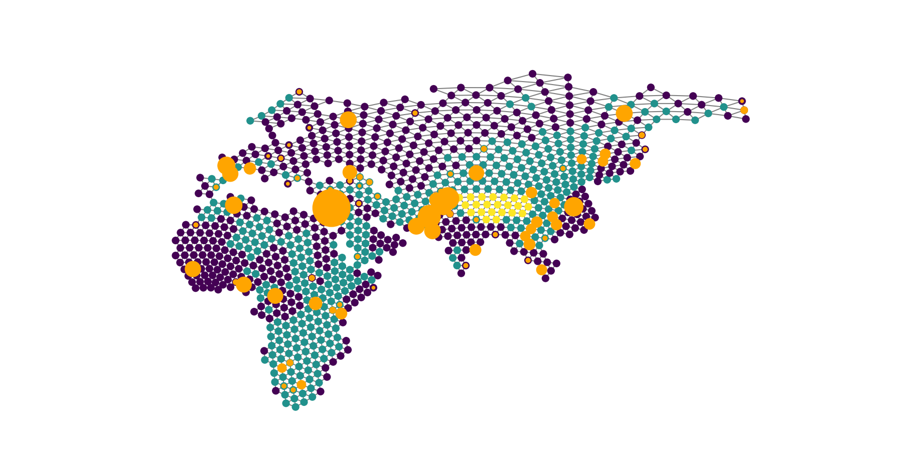

`terracotta` is a Python package for estimating migration surfaces and the locations of genetic ancestors from gene trees and/or small ancestral recombination graphs. **This package is in early development, so there may be rapid/breaking changes to the functionality and options going forward.**

### Creating environment

Download the `.zip` of the repository from GitHub. This tutorial uses `conda` to manage the environment, though there are many options if you prefer another.

```
conda env create -f environment.yml
conda activate terracotta
```

### Quickstart

Within the [example_dataset/](https://github.com/kitchensjn/terracotta/example_dataset/) folder, you can find an example `demes.tsv`, `samples.tsv`, and `trees/` folder which are the necessary inputs for this method. The following code can also be found in [example_dataset/run.py](https://github.com/kitchensjn/terracotta/example_dataset/run.py).

#### Loading the inputs

```
import pandas as pd
import sys
sys.path.append("..")   # if you are running from `example_dataset/`, otherwise path to `terracotta/`
import terracotta as tct
import tskit
from glob import glob

demes = pd.read_csv("demes.tsv", sep="\t")
samples = pd.read_csv("samples.tsv", sep="\t")
world_map = tct.WorldMap(demes, samples)
trees = [tskit.load(ts).simplify().first() for ts in glob(f"trees/*")]
```

`trees/` is a preprocessed directory of `.trees` files in the `tskit` format. These files only contain a single tree each. By loading it in this way, you've created a list of `tskit.Trees`.

#### View the world map

```
world_map.draw(
    figsize=(15,15),
    color_demes=True,
    show_samples=True
)
```



Here, demes have been colored according to their type set by `demes.tsv`. Orange circles mark demes with samples, where the size of the circle is proportional to the number of samples found in that deme.

#### Estimate the most likely migration surface

`terracotta` uses `numba` to speed up the likelihood calculations, but `numba` does not know how to handle a `tskit.Tree`. We first need to break each tree down into a simpler format **(very likely for this format to change in the future)**.

```
import numpy as np

cl = []
bal = []
r = []
for tree in trees:
    child_list, branch_above_list, roots = tct.convert_tree_to_tuple_list(tree)
    cl.append(child_list)
    bal.append(branch_above_list)
    r.append(roots)

total_number_of_edges = 0
for tree in trees:
    total_number_of_edges += tree.num_edges+1
branch_lengths = np.zeros(total_number_of_edges, dtype="int64")
edge_counter = 0
for tree in trees:
    for node in tree.nodes(order="timeasc"):
        branch_lengths[edge_counter] = int(tree.branch_length(node))
        edge_counter += 1
branch_lengths = np.unique(np.array(branch_lengths))
```

The following code may take multiple minutes to run: 

```
from scipy.optimize import minimize

mr = np.array([4.32e-03, 4.95e-02, 0])

print(
    minimize(
        tct.calc_migration_rate_log_likelihood,
        mr,
        method="nelder-mead",
        bounds=[(0, 1), (0, 1), (0, 1)],
        args=(world_map, cl, bal, r, branch_lengths)
    )
)
```

#### Tracking a lineage over time

To track a lineage over time you need to estimate the location of the lineage at specified time points within the tree.

```
positions = tct.track_lineage_over_time(
    sample=1500,
    times=range(0,11000,1000),
    tree=trees[0],
    world_map=world_map,
    migration_rates=mr
)

for time in range(0, 11000, 1000):
    world_map.draw_estimated_location(
        location_vector=positions[time],
        figsize=(15,15),
        title=f"{time} generations in past"
    )
```

### Map Builder

Within the [map_builder/](https://github.com/kitchensjn/terracotta/map_builder) folder, there are two D3.js based tools for creating `demes.tsv` and `samples.tsv`. These can be useful for generating test cases, such as changing the type of demes interactively, though are not intended to replace more powerful GIS-based workflows. You will need to access these tools through a Live Server. See `tct.create_demes_file_from_world_builder()` and `tct.create_samples_file_from_world_builder()` for information about how to create your input files with these tool.