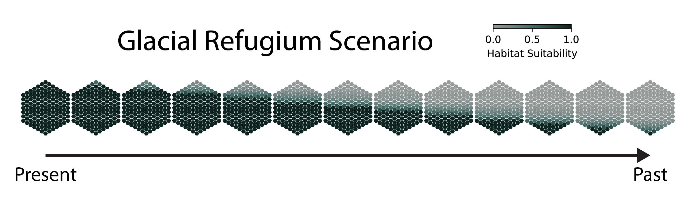

`terracotta` is a Python package for estimating migration surfaces and the locations of genetic ancestors from gene trees and/or small ancestral recombination graphs. **This package is in early development, so there may be rapid/breaking changes to the functionality and options going forward.**

### Creating environment

Download the `.zip` of the repository from GitHub. This tutorial uses `conda` to manage the environment, though there are many options if you prefer another.

```
conda env create -f environment.yml
conda activate terracotta
```

### Tutorial - Example dataset

Within the [example_dataset/](https://github.com/kitchensjn/terracotta/tree/main/example_dataset) folder, you can find a `dataset` folder with `demes.tsv`, `connections.tsv`, `samples.tsv`, and `trees/` folder. These are the four necessary inputs for `terracotta`. This example dataset models an expansion out of a glacial refugium 1000 generations in the past, as shown in the below figure. The trees were simulated with `msprime` using a demographic model built from the world map files.



#### Input file structure

##### demes.tsv

This is a tab separated file with four mandatory columns:
- `id`: integer ID of the deme
- `xcoord`: x-coordinate of deme for plotting
- `ycoord`: y-coordinate of deme for plotting
- `suitability`: either a float or a string with the format `time:suitability,time:suitability,...` if the suitability changes through time

##### connections.tsv

This is a tab separated file with four mandatory columns:
- `id`: integer ID of the connection
- `deme_0`: ID for the source deme of the edge (matching `demes.tsv`)
- `deme_1`: ID for the target deme of the edge (matching `demes.tsv`)
- `migration_modifier`: either a float (if known), string (if unknown), or a string with the format `time:modifier,time:modifier,...` if the modifier changes through time 

##### samples.tsv

This is a tab separated file with two mandatory columns:
- `id`: integer ID of the sample as it appears in the trees
- `deme`: ID of the deme where the sample was found

##### trees/

This folder contains all of the gene trees stored as `tskit` tree files, each with only one tree in it.


#### Estimate the most likely migration surface

```
import terracotta as tct

result, loglikelihood = tct.run(
    demes_path="dataset/demes.tsv",
    connections_path="dataset/connections.tsv",
    samples_path="dataset/samples.tsv",
    trees_dir_path="dataset/trees",
    output_file="output.tsv"
)
```

`terracotta.run()` estimates the most likely migration surface using the `Nelder-Mead` hill-climbing algorithm. Here, it estimates two unknown parameters: `coefficient` (the default migration rate) and `alpha` (the exponent of the suitability ratio). Migration rate modifier variables will be automatically included in this search if present in `connections.tsv`.


#### Loading the world map

```
import pandas as pd
import terracotta as tct

demes = pd.read_csv("demes.tsv", sep="\t")
connections = pd.read_csv("connections.tsv", sep="\t")
samples = pd.read_csv("samples.tsv", sep="\t")
world_map = tct.WorldMap(demes, connections, samples)
```

#### Tracking a lineage over time

To track a lineage over time you need to estimate the location of the lineage at specified time points within a tree.

```
import tskit
from glob import glob

trees = [path for path in glob("dataset/trees/*")]

sample = 0
times = range(0, 100, 10)
tree = trees[0]

positions = tct.track_lineage_over_time(
    sample=sample,
    times=times,
    tree=tree,
    world_map=world_map,
    parameters=result
)

for position in positions:
    fig, axs = plt.subplots()
    axs.scatter(world_map.demes["xcoord"], world_map.demes["ycoord"], marker="H", s=400, c=position)
    axs.set_aspect("equal")
    axs.margins(0.065)
    axs.axis("off")
    plt.show()
```