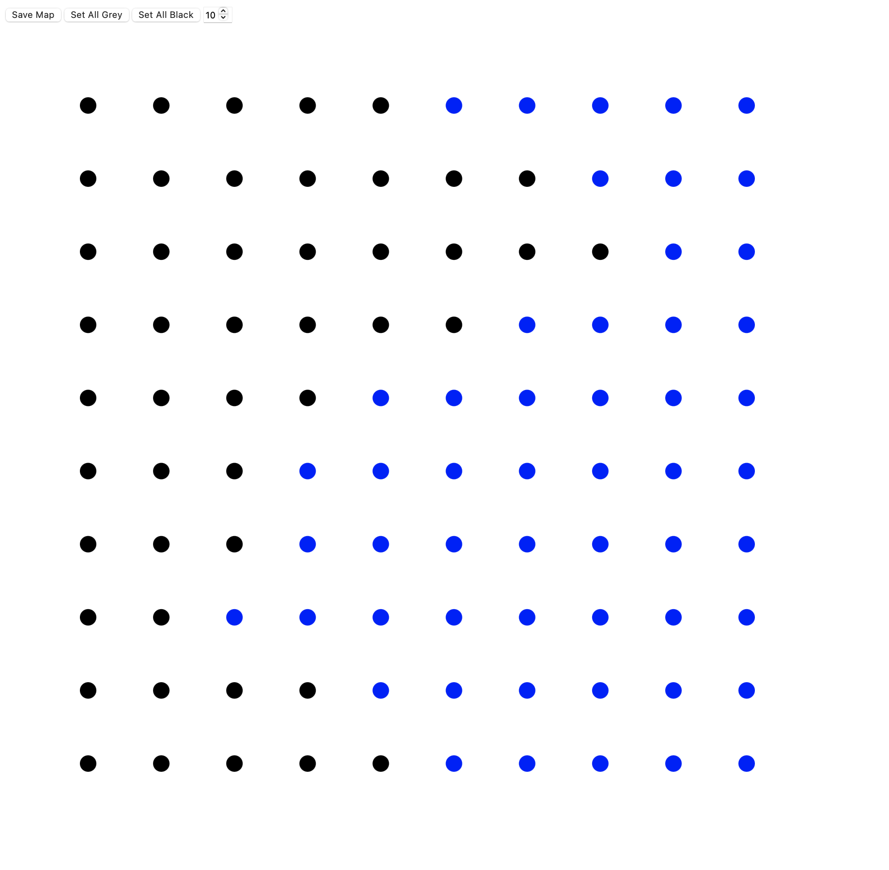
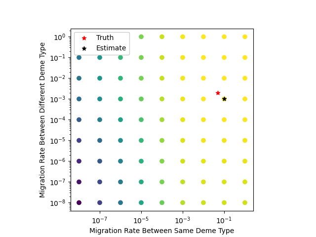
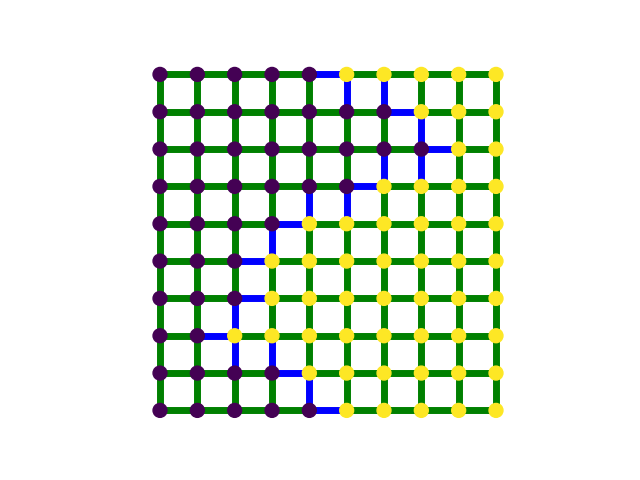

# Topics

- World map builder
- Drawing migration surfaces
---

### From 2025-01-27 to 2025-02-09

Random maps have been helpful for getting things started but I needed a way to generate maps with recognizable features and boundaries. To do this, I thought it would be best to create a small map builder tool so that I can quickly create many different scenarios without having to go in and handwrite the `demes.tsv` files. With what I've learned from the `tskit_arg_visualizer` project, it was relatively easy to put together a simple tool with `D3.js`, a great library for building interactive designs. `d3_map_builder.html` holds all of the code for the tool and is currently in the main repository, though I may move it to a new folder in the future. I just wanted to get a minimum example, so there are definitely things that could be improved to make it more usable but I don't really think that is worth it for it's current purpose.

In the map builder, you set the size of the map you are working with using the numeric dial. Here, I have a 10x10 grid of demes. The color of the demes corresponds with their type. Grey is an inactive deme, which allows for non-square maps. The three active deme types are black, blue, and red, which don't correspond with anything and are really just labels. Later on you can set what migration rates the colors correspond to. More colors can be added but three seemed like enough to get started. Clicking the deme rotate through the colors. There's two buttons to set all of the demes either to grey or black to avoid unnecessary clicking. In this example, I've set up a scenario with two deme types and a jagged border between them. Once you are happy with the map, click the "Save Map" button which downloads a `.csv` file with your map details.

You will then need convert this `.csv` into the `demes.tsv` files. I have a rough draft of the code to do this but it hasn't yet been incorporated into the `terracotta` package. Lastly, I had to make `create_samples_and_trees_files()` "public" (remove the "_") so that we can finish creating the dataset using this custom `demes.tsv` file.

`terracotta` was able to correctly estimate the migration rates on the custom map, which we've seen in a previous devlog. Visualizing this as a migration surface, similar to EEMS, would be helpful, so I reworked `draw()` to take in a dictionary of migration rates for each type of transition that could be used to color the edges in the drawing. In the figure below, green edges have high migration and blue edges have low migration.

As a note, we are still providing `terracotta` with the deme types, so the fact that it finds the jagged boundary between the broader regions is not surprising. The bigger deal is that `terracotta` is able to correctly estimate the rates under non-random map conditions.