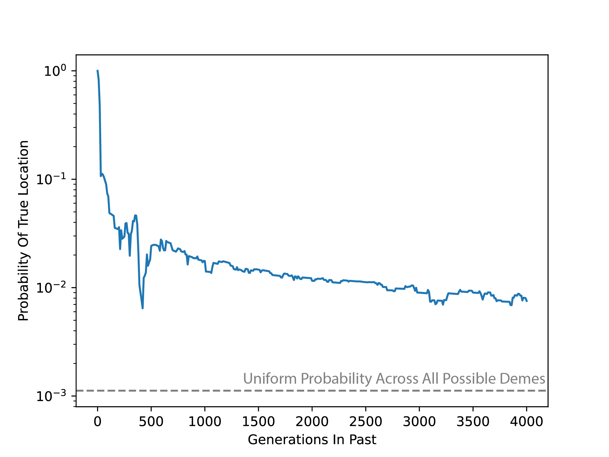

# Topics

- Maize meeting example
- Global versus local optimizer
- Viewing all histories of a sample

---

### From 2025-06-30 to 2025-07-31

I was interested in looking at the accuracy of the ancestral location predictions. This led me to realize that there was a better way of simulating the trees where it retains even more migration information. Rather than using `record_full_arg=True`, you can use `record_migrations=True, additional_nodes=msprime.NodeType.MIGRANT, coalescing_segments_only=False`, which creates a table of the migration events. This lets you more easily filter through the migration events rather than having to look at nodes and backtracing. I've updated `_simulate_independent_trees()` function in `create.py` to use this new set of parameters.

**Update:** After finding the above, it turns out that `simplify()` does not work on trees or ARGs that were simulated with `record_migrations=True`. This is disappointing and there may be a work around, but for now, I'm going to switch back to `record_full_arg=True`.

With that, I simulated a tree on the Africa, Asia, Europe map (AAE map) with the approximately 1900 samples in that region from Wohns et al. During simulation, I recorded the migration events which allowed me to track the location of every lineage at any point in time. I estimated the location of one of the lineage using the migration surface which matched the simulated parameters (`migration_rate=0.01`). Finally, using those estimates, I looked at the estimated probability of the true location of the lineage over time. For instance, if the lineage was found in Deme 237 100 generations in the past, and `terracotta` estimated that there was a 10% chance of the lineage being in that deme, then the plot would be 0.1 at t=100.

We see the expected pattern that estimates get worse as we look deeper into the past, but they remain an order of magnitude higher than the uniform probability across all possible demes (`1/num_demes`). I'll need to run this for more scenarios, but I'm pretty happy with how this turned out. One thing to note is that the location estimation script is incredibly slow for what it is, and I will need to speed it up if I want to run it in the November conference.

