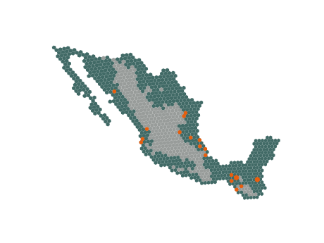
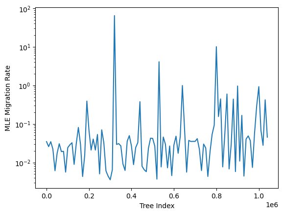
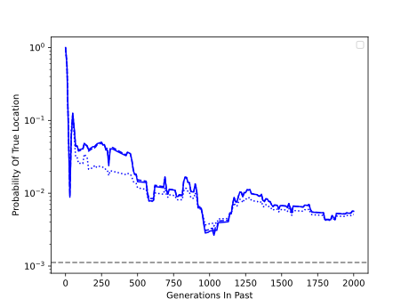

# Topics

- Maize meeting example
- Viewing all histories of a sample

---

### From 2025-06-30 to 2025-07-31

For the maize meeting in July, I presented my work so far with `terracotta` (same presentation as from the Evolution conference), as well as applying the method to some maize samples. Here, the deme types are determined by elevation binned to above or below 1500ft. This separates the highlands from the lowlands of Mexico and is roughly around the boundary for Z. mays ssp. mexicana, which is found at higher elevations. The sampling distribution has very few samples above 1500ft, which limits our ability to differentiate migration rates at higher elevations.

We see significant variability in migration rate estimates across trees. Investigating this further, there are some trees with extremely fast coalescent times (shown below) that lead to high migration rates.

This appears to be a poorly called tree, rather than something biologically interesting. But being aware of these kinds of inference artifacts and their impact on estimates will be important when working with real data.

I was interested in looking at the accuracy of the ancestral location predictions. This led me to realize that there was a better way of simulating the trees where it retains even more migration information. Rather than using `record_full_arg=True`, you can use `record_migrations=True, additional_nodes=msprime.NodeType.MIGRANT, coalescing_segments_only=False`, which creates a table of the migration events. This lets you more easily filter through the migration events rather than having to look at nodes and backtracing. I've updated `_simulate_independent_trees()` function in `create.py` to use this new set of parameters.

**Update:** After finding the above, it turns out that `simplify()` does not work on trees or ARGs that were simulated with `record_migrations=True`. This is disappointing and there may be a work around, but for now, I'm going to switch back to `record_full_arg=True`.

With that, I simulated a tree on the Africa, Asia, Europe map (AAE map) with the approximately 1900 samples in that region from Wohns et al. During simulation, I recorded the migration events which allowed me to track the location of every lineage at any point in time. I estimated the location of one of the lineage using the migration surface which matched the simulated parameters (`migration_rate=0.01`). Finally, using those estimates, I looked at the estimated probability of the true location of the lineage over time. For instance, if the lineage was found in Deme 237 100 generations in the past, and `terracotta` estimated that there was a 10% chance of the lineage being in that deme, then the plot would be 0.1 at t=100.

We see the expected pattern that estimates get worse as we look deeper into the past, but they remain an order of magnitude higher than the uniform probability across all possible demes (`1/num_demes`). I'll need to run this for more scenarios, but I'm pretty happy with how this turned out. One thing to note is that the location estimation script is incredibly slow for what it is, and I will need to speed it up if I want to run it in the November conference.

A likely important observation with spatial ARGs is that "bubbles" (a.k.a. "diamonds") are more common under a spatial model compared to panmixia. This is anecdotal, but it makes sense that when you have limited migration, lineages that are close together are both more likely to coalesce and recombine together (depending on forward versus backward in time) - poorly worded but this point would be worth discussing at the ARG conference. In an example ARG that was simulated on the map of Africa, Asia, and Europe with a migration rate of 0.01 and deme size of 50, of the 718 recombination events in the ARG, 458 created "bubbles" (this is specifically recombination nodes that are directly connected to the same coalescent node above, so there could be more complicated "bubble" structures that are not counted here). It's not just that the timing of nodes changes under the spatial model, but the topology does as well. These "bubbles" are often ignored by ARG inference methods, which could lead to biases. For this reasons, I think it's important to test `terracotta` on ARGs shaped similarly to those output by inference methods as this will be most similar to how people will use this tool, but from a theoretical stance, "bubbles" should affect the dispersal patterns at least of the lineages closely involved. Expanding this, "bubbles" likely don't impact dispersal patterns of lineages further away in the graph compared to other loop structures which involve more lineages. Simply counting the number of recombination events may not be a good one-to-one comparison between ARGs. That being said, the simplification algorithm doesn't just lose these "bubbles", it also distorts the inheritance pattern represented by the graph, so there are potentially other biases being introduced when working with simplified ARGs.

Looking back on the above plot, it is not necessarily fair to only compare to the uniform probability. That would be the absolute worst scenario, whereas if you have the sample location, you're general intuition would say that the ancestor is most likely somewhere in that vicinity. Knowing this, we can compare `terracotta`'s estimates against a diffusion that is not informed by the tree. This new estimate takes will still use the migration rates from the migration surface. This approach could be used with a `FEEMS` migration surface as that's a scenario where you have a surface but no tree information.

In this figure, I'm tracking a random single lineage back in time. The solid line is using the ARG, the dashed line is using the local tree, and the dotted line is the uninformed estimate. I'm using a `tskit` simplified ARG (following the reason above). We see that generally, the informed estimates outperform the uninformed estimate, and there isn't a ton of difference between using one tree or the simplified ARG which includes 365 trees. I wonder if the lack of difference is due to the simplification algorithm separating edges in a way that reduces the effectiveness of the belief propagation. For instance, the average degree of nodes is increased by the simplification process.