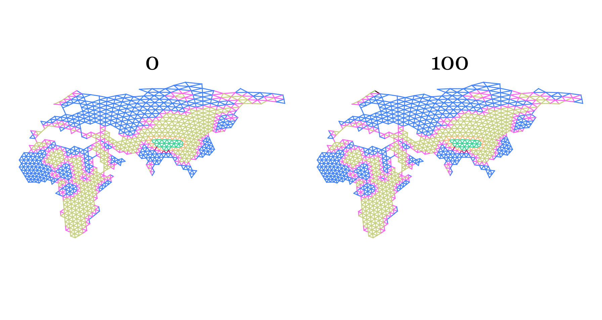
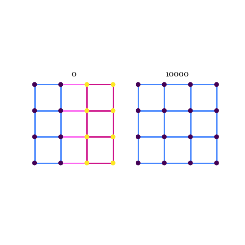
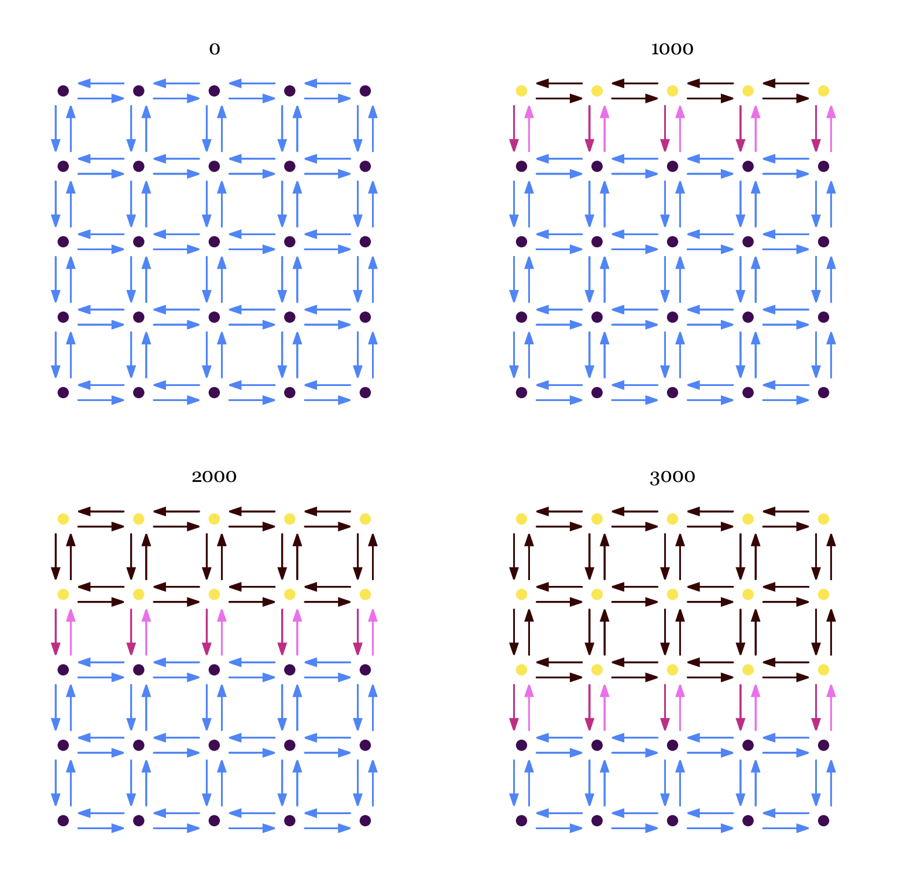

# Topics

- Epochs
- Asymmetric migration

---

### From 2025-09-29 to Present

#### Epochs

```
id	xcoord	ycoord	type	neighbours
0	24.35554546084572	70.69582613722945	0	29,33
1	140.24900275289315	72.16123648187042	0	6,7
2	141.40923257425092	66.81847831948762	1	3,4,5,6,7,8
3	149.27222925193394	66.81693984187014	0	2,5,7,11,13,179
4	138.30973121891174	64.06476794657276	1	2,5,8,141,142,163
```

Above is an example `demes.tsv`. Currently, deme types are given one type for the whole back propagation. You could see a scenario where conditions change over time, constituting a need for a different migration rate and therefore deme type. If only one number is given, we can assume that the rate is the same the whole time. Alternatively, if type is set to `0:0,100:4`, I am saying that from 0 to 100 generations before present, the deme is of type `0`, then deeper than 100 generations, it is of type `4`. This ensures that types are shared across epochs, which will give more power to the estimates. So far this seems like the most compact way of doing this, as the connections don't change between epochs, so we don't want a completely new `demes.tsv` file. This format won't make sense to the `pandas`, so further processing will be required to get these into `WorldMap.connections`. Rather than `WorldMap.connections` being a single `pandas.DataFrame`, it needs to be a list with associated epochs.

I'm allowing `demes.tsv` to have either `0` or `0:0` format for specifying that the deme is of type 0 for the entire duration. When this is converted to a `WorldMap`, it will always be changed to `0:0`. This ensures that the column is always a string and of a consistent format, versus having to handle different data types (which quickly became a nightmare so I rethought and streamlined).

Today, I implemented some of these changes. The algorithm has not been updated to address the new epochs format, but I'm getting close. The major difference is that `WorldMap.connections` is now a list of `pandas.DataFrames` with an associated list `WorldMap.epochs` that gives the start time of each epoch. As a warm-up to this new format, I started by updating `WorldMap.draw()` to capture the map at different time points. That's not quite done, but it's close.



Now, it draws a world map for each epoch. In this example only one deme changes type between maps, but you can imagine everything changing. The new `draw()` does not have all of the features of the old draw, such as plotting sample locations, and that is a conscious decision because I felt like things were getting too cluttered. I may revisit that later.

I realized that the dataset creation functions, such as `create_trees_files()`, needed to be updated to allow for changing rates. `msprime.Demography().add_migration_rate_change()` allows for migration rates to be changed at specified times. I reworked `_set_up_msprime_demography()` now that `WorldMap.connections` is a list. It now loops over the list and whenever there's a rate change, it adds a demographic event at the epoch time with the new rate.



A clear example of this is when there is a barrier in the recent past but not in the deep past. If blue and dark pink transitions have the same rate, and light pink has a rate of 0, you will get coalescence events between samples found in the same deme type but not different until 10,000 generations in the past when the map changes.

```
13275.02┊                     30                ┊
        ┊                ┏━━━━━┻━━━━━┓          ┊
1055.15 ┊                ┃          29          ┊
        ┊                ┃      ┏━━━━┻━━━━┓     ┊
527.10  ┊               28      ┃         ┃     ┊
        ┊             ┏━━┻━━┓   ┃         ┃     ┊
457.45  ┊             ┃     ┃   ┃        27     ┊
        ┊             ┃     ┃   ┃       ┏━┻━━┓  ┊
333.47  ┊            26     ┃   ┃       ┃    ┃  ┊
        ┊         ┏━━━┻━━┓  ┃   ┃       ┃    ┃  ┊
238.99  ┊        25      ┃  ┃   ┃       ┃    ┃  ┊
        ┊     ┏━━━┻━━━┓  ┃  ┃   ┃       ┃    ┃  ┊
192.50  ┊     ┃       ┃  ┃  ┃   ┃      24    ┃  ┊
        ┊     ┃       ┃  ┃  ┃   ┃     ┏━┻━┓  ┃  ┊
188.27  ┊     ┃       ┃  ┃  ┃  23     ┃   ┃  ┃  ┊
        ┊     ┃       ┃  ┃  ┃  ┏┻━┓   ┃   ┃  ┃  ┊
172.27  ┊    22       ┃  ┃  ┃  ┃  ┃   ┃   ┃  ┃  ┊
        ┊   ┏━┻━┓     ┃  ┃  ┃  ┃  ┃   ┃   ┃  ┃  ┊
127.24  ┊   ┃  21     ┃  ┃  ┃  ┃  ┃   ┃   ┃  ┃  ┊
        ┊   ┃  ┏┻━┓   ┃  ┃  ┃  ┃  ┃   ┃   ┃  ┃  ┊
124.82  ┊   ┃  ┃  ┃   ┃  ┃  ┃ 20  ┃   ┃   ┃  ┃  ┊
        ┊   ┃  ┃  ┃   ┃  ┃  ┃ ┏┻┓ ┃   ┃   ┃  ┃  ┊
114.62  ┊  19  ┃  ┃   ┃  ┃  ┃ ┃ ┃ ┃   ┃   ┃  ┃  ┊
        ┊ ┏━┻┓ ┃  ┃   ┃  ┃  ┃ ┃ ┃ ┃   ┃   ┃  ┃  ┊
107.37  ┊ ┃  ┃ ┃  ┃   ┃  ┃  ┃ ┃ ┃ ┃   ┃   ┃ 18  ┊
        ┊ ┃  ┃ ┃  ┃   ┃  ┃  ┃ ┃ ┃ ┃   ┃   ┃ ┏┻┓ ┊
58.53   ┊ ┃  ┃ ┃  ┃  17  ┃  ┃ ┃ ┃ ┃   ┃   ┃ ┃ ┃ ┊
        ┊ ┃  ┃ ┃  ┃ ┏━┻┓ ┃  ┃ ┃ ┃ ┃   ┃   ┃ ┃ ┃ ┊
29.30   ┊ ┃  ┃ ┃  ┃ ┃  ┃ ┃  ┃ ┃ ┃ ┃  16   ┃ ┃ ┃ ┊
        ┊ ┃  ┃ ┃  ┃ ┃  ┃ ┃  ┃ ┃ ┃ ┃ ┏━┻┓  ┃ ┃ ┃ ┊
0.00    ┊ 0 15 4 12 6 14 2 10 1 3 8 5 13 11 7 9 ┊
        0                                       1
```

This results in trees like the one above, which shows that the simulation is working as expected. I'm pretty happy with this so think it's time to move on to the belief propagation algorithm.

The overall structure of the algorithm remains the same. It first deconstructs the trees into more primitive objects, precalculates the transition probabilities for different branch lengths, then traverses the trees from sample to root to calculate the likelihood. I've made changes to every step to get this to work with epochs.

##### Deconstructing trees

You need to deconstruct the `tskit.Tree` object into lists and arrays in order to use `numba`. I previously was creating a $nodes \times nodes$ child array with ones when the column was a child of the row. This was a very sparse matrix and clearly not very efficient. Knowing that every node has at most one parent, the parent id can be stored as a vector of length $nodes$, where -1 is used for nodes without a parent. This also makes it very easy to identify roots in the tree with `np.where(parents == -1)`. The parent vector gives the topology, but it still needs the branch lengths. This is stored in a $epochs \times nodes$ array, where each value is the amount of time that the branch above the node spends in that epoch. With a single epoch, this collapses to a vector of branch lengths above the focal node. For roots, this value is 0. These two arrays (or three if I include roots separately), are all we need to store a tree.

##### Precalculating the transition probabilities

An important difference to the single epoch situation is that with multiple epochs, we need the unique branch lengths within each epoch. This is pretty straightforward by looking for unique branch lengths within each row of the branch above array. From here, there are two ways to calculate the transition probabilities say for a two epoch setup:

$
e^{(Q_0t_0+Q_1t_1)} = (e^{Q_0t_0})(e^{Q_1t_1})
$

Here, $Q_0$ and $t_0$ are the transition matrices and branch length within epoch 0. The left side of the equation has fewer exponentiations, but the right side likely benefits from reusing calculations. The current implementation uses the right side, as that was simpler to write given the previous setup, but I'm not sure that is actually the best. Worth talking with others! I precalculated all $(e^{Q_x})^{t_x}$ for every $t$ and every $Q$, before later combining during the tree traversal. For now, I'm not going to precalculate the log versions of the transition matrices. I may want to do this in the future.

##### Traversing the trees

Because I'm working with a parent vector rather than a child array, the traversal now identifies children differently but ultimately with the same results. The biggest change here is handling edges that cross multiple epochs (see right side of the above equation). These different exponentiated matrices need to be combined prior to being combined with the node location. Other than that, this is relatively the same as before.

##### Example

With the 4x4 two epoch map (above), I set the migration rates to 0.01, 0.00, and 0.01 for blue, light pink, and dark pink transitions. I put 16 haploid samples on the map, one in each deme, and simulated 100 trees. Running terracotta, the most likely migration rate combination from the SHGO output was `[1.22901546e-02 2.06115362e-09 8.24933142e-03]`, where `2.06115362e-09` was the lower bound as 0 is not an accessible value. So in this very simple scenario, the algorithm works.


#### Asymmetric migration

I've been putting this off due to concerns that asymmetric migration both greatly increases the number of migration rates that need to be estimated and potentially leads to biases in estimates (from conversations with Andrew and Rasmus). But as I was working through a scenario of glacial retreat that has been a goal of ours to recreate, I believe that the only way to handle it is with asymmetric migration.

Say we have a map with two deme types: habitable or not. At present day, the entire map is habitable, but as you move deeper into the past the "glacier" covers more and more of the northern side of the map. Backwards in time, there needs to be some force driving lineages from the uninhabitable demes to the habitable ones. I've reworked `WorldMap.draw()` to allow for asymmetrical lines. There's some fun geometry in how to position things, but it's not relevant to this devlog. Here's a map showing the glacier retreat scenario:



One concern I have with this (or a water body equivalent scenario) is that lineages could potentially use the uninhabitable regions as super highways to traverse to other sides of the map quickly. This makes some sense with long distance migrations across oceans, but it should be infrequent. Hopefully this is controlled by the rate of migration into the uninhabitable regions (light pink transitions).


Note: running more trees always gives a lower composite likelihood (obviously). Should their be a way to normalize over number of trees.