# Topics

- Asymmetric runaway rates

---

### From 2026-03-09 to 2026-04-06

This devlog is meant to lay out my thoughts on why asymmetric rates are not working as expected. I'll try to draw on some examples from literature, but a lot of this will focus on issue that are apparent event in the 1D world map with two samples scenario.

 
 

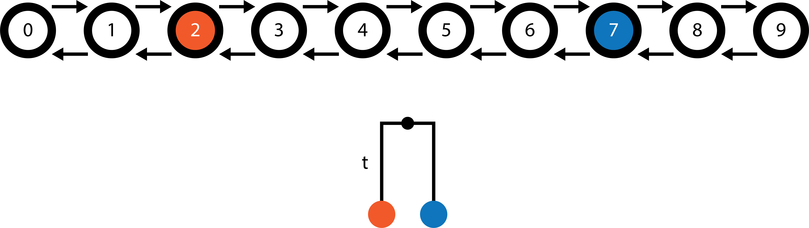

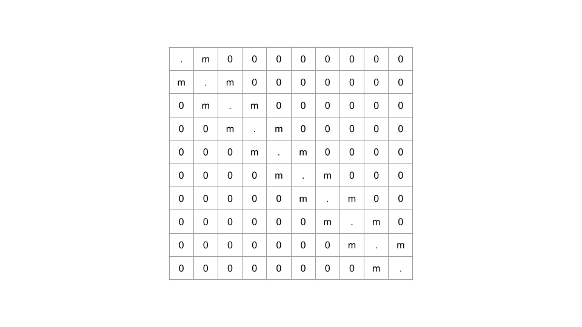

 
 

We have a 1D world map consisting of 10 demes with migration only between neighboring demes. The orange sample is found in deme 2 and the blue sample is found in deme 7. The goal of `terracotta` is identify the combination of migration rates (migration surface) which maximizes the likelihood of the tree. For this example tree with two samples, calculating the likelihood of the tree involves multiplying the probability distributions for the ancestral locations of the orange and blue lineages given the migration surface and then summing across all 10 demes. Intuitively, the most likely migration surface will be one which brings the most of each lineage's ancestral probability mass into the deme at the time of coalescence.

When migration rates are symmetrical, an increase in the migration rate between two demes leads to greater diffusion of the probability distribution. Say the migation rate is the same between all neighboring demes (only one value). When migration rates are too low, it's unlikely that the orange and blue ancestral lineages will be in the same deme at the time of coalescence. As the migration rate increases, the overlap in their distributions becomes more likely. But then when migration rates are very high, the distributions can become overdispersed leading to a lower likelihood of the tree. This likelihood curve allows `terracotta` to find the optimum migration rate for this tree with a simple search.

 
 

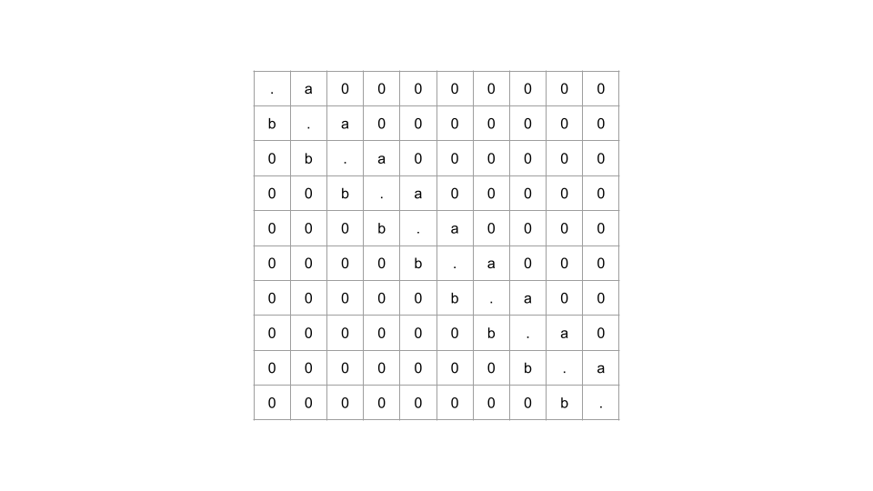

 
 

The difficulty comes whe we want to introduce asymmetric rates to the method.  To keep things simple, we are going to allow for only two different migration rates: 1) "a" to the right and 2) "b" to the left. We might then expect that the migration to the right is greater than the migration to the left because there's more suitable habitat to the right, but how much greater? Remembering that the likelihood increases as more of the two ancestral location probability masses overlap, continually increasing the migration rate to the right and decreasing the rate to the left will focus all of the mass on deme 9, leading to a higher and higher likelihood. This is where the bias comes in! Unlike in the symmetrical, faster and faster rates do not necessarily lead to overdispersal.

 
 

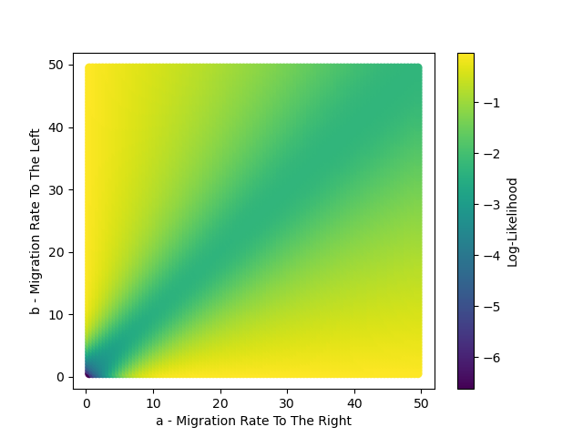

 
 

These runaway rates occur because `terracotta` does fully account for the coalescent process and so does not penalize lineages being in the same deme when not coalescing. In fact, the blue lineage does not even move towards the orange lineage in either optimal scenario; instead both lineages move in the same direction to get to the end of the world map as quickly as possible. This is most apparent with maps where it's simple to create "absorbing" demes, such as the 1D world map. There is generally less connectedness in the transition matrices we are using with `terracotta` compared to the nucleotide substitution model state space, though the amino acid subsitution models may be more comparable.

But these rates very large rates are almost certainly biologically irrelevant. Zooming into the bottom left corner of the state space, there's a different story.

 
 

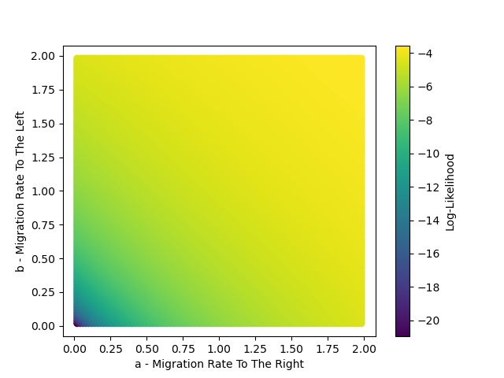

 
 

When rates are capped to be too low for lineages to effectively run to the corner, they instead optimize on a symmetrical migration solution, though this isn't the case for all scenarios. For example if the orange sample starts in deme 4 and the blue sample starts in deme 5, then we see an asymmetric optimal solution but where it doesn't run away ($a=0.78$ and $b=0.00$, or vice versa).

 
 

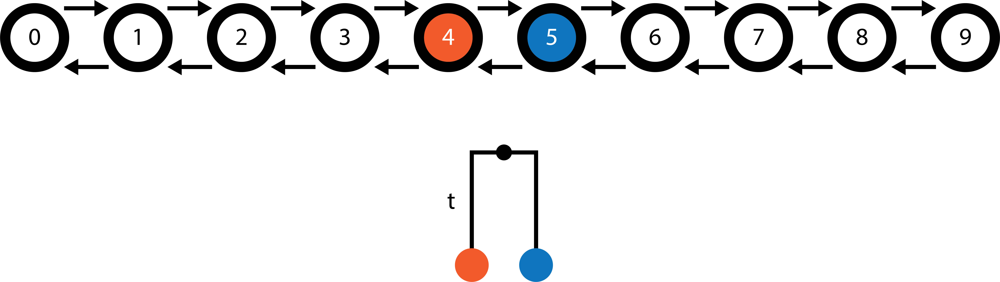

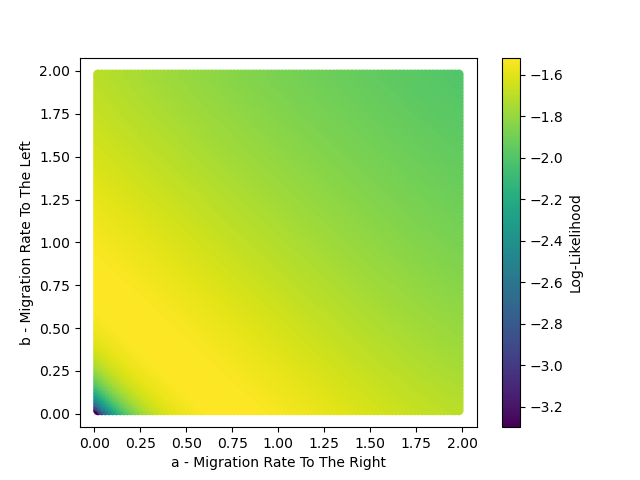

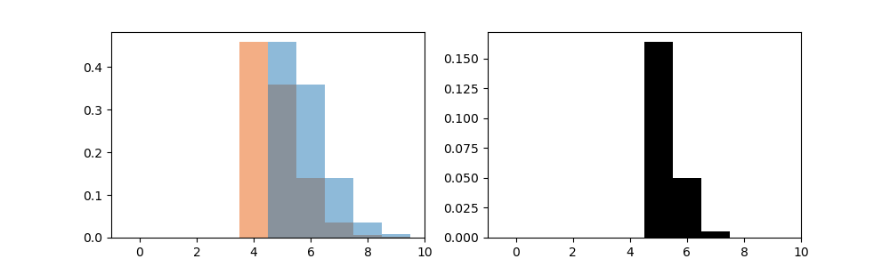

 
 

Here are the ancestral location probability distributions for the orange and blue lineages and black is the overlap in those distributions. This is very slightly more optimal than the symmetrical solution of $a=b=0.38$, which has a log-likelihood of $-1.51834$ compared to a log-likelihood of $-1.51828$ for the asymmetric case. Importantly, the rates do not run away within these bounds and instead find an optimum which is potentially biologically relevant.

 
 

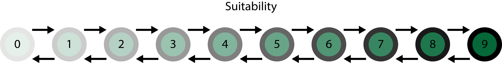

 
 

Lastly, we want to set the rates based on the suitability of the demes rather than an arbitrary value. Say suitability increases as we move to the right and it represented by a vector $s=[s_0, s_1, ..., s_8, s_9]$. For the above example world map, $s=[0.1, 0.2, ..., 0.9, 1.0]$. The backwards migration rate between deme 0 and deme 1 is then $m(\frac{s_1}{s_0})^a$, where $m$ is the default migration rate and $a$ modifies the impact of the suitability ratio. Altogether, the transition matrix is...

 
 

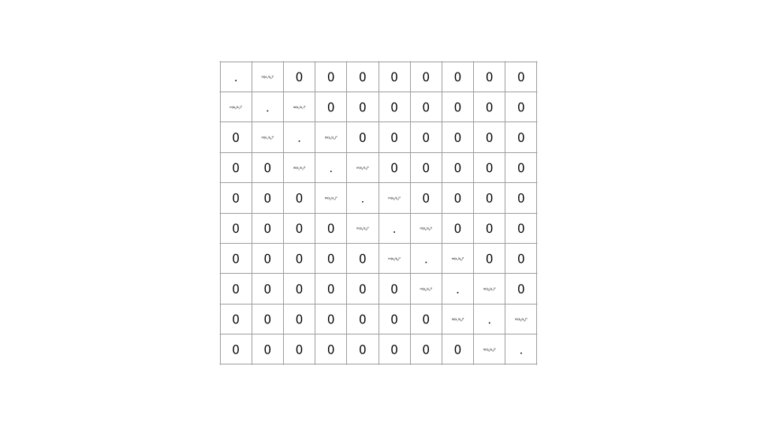

 
 

We observe asymmetrical migration in regions of the map with a large ratio in suitability between neighboring demes. When the ratio is small, migration rates will be more symmetrical.

 
 

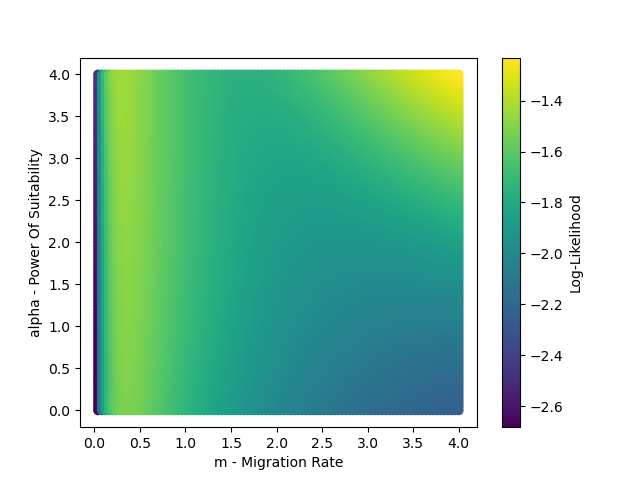

 
 

Once again, we need to cap $m$ and $a$ in some way to prevent runaway. Bounding $a$ between (0 and 1) or (-1 and 1) likely makes sense. $m$ is more challenging, and I don't know the best strategy for determining its bounds.

 
 

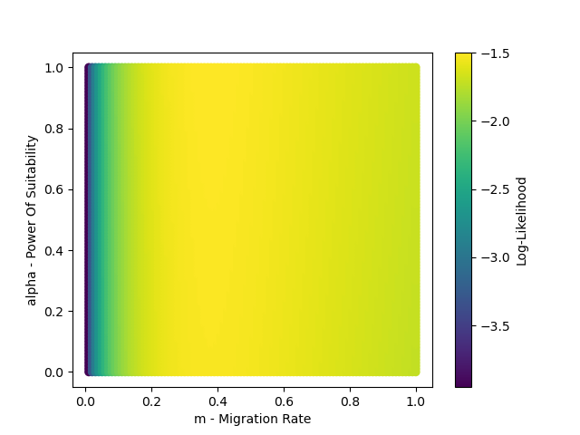

 
 

Here after capping, the optimal combination was $m=0.39$ and $a=1$. Certain suitability maps (such as $s=[0.1, 0.8, 0.6, 0.4, 0.2, 0.2, 0.4, 0.6, 0.8, 1.0]$, where suitability is lowest in the center) are more optimized when $a=0$, so it is not always the case that $a=1$ is best. Potentially looking at trees with more samples and multiple trees at once may lead to intermediate values of $a$ being optimal.