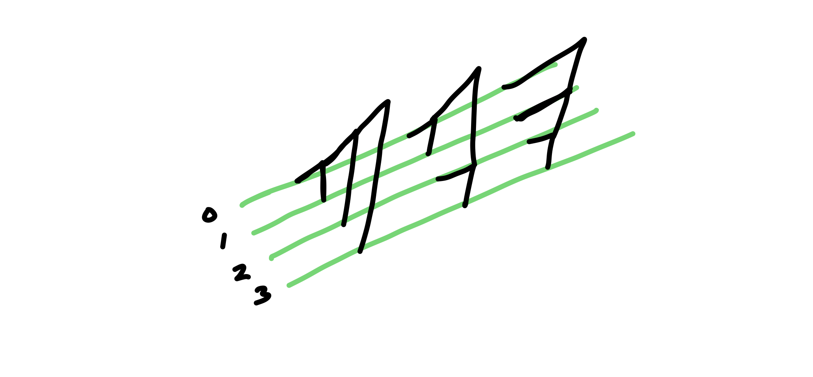
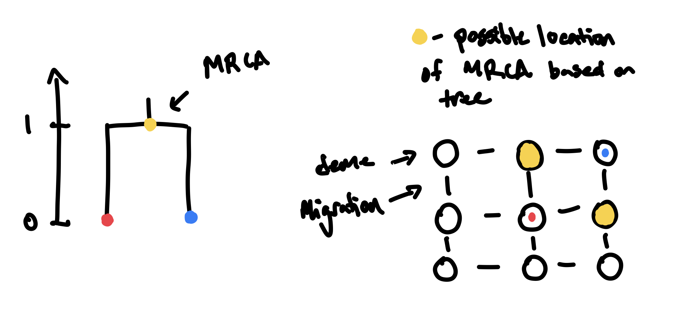
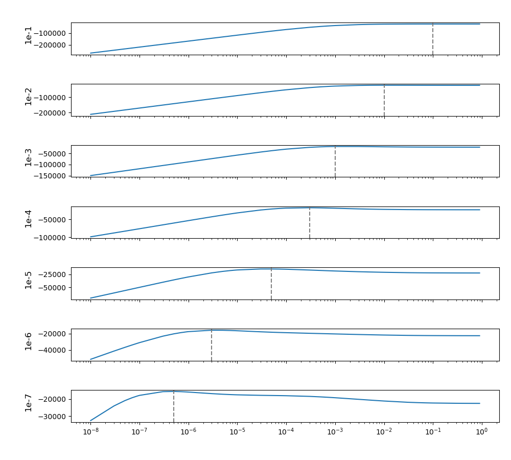
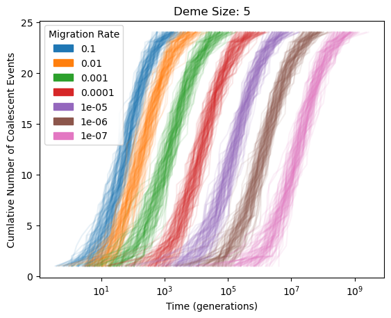
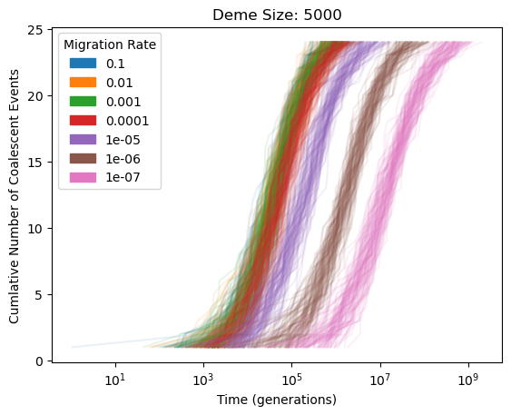
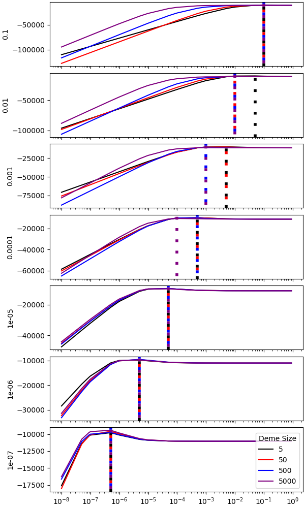
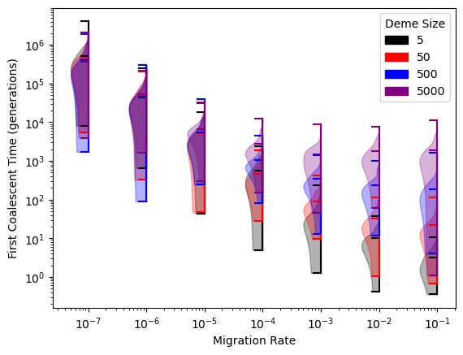

# Topics

- Broad overview of the devlogs
- Introduction to `terracotta`
- Calculating the (log-)likelihood of a tree (#3)
- Simulating trees with `msprime` under demographic model (#4)
- Population size simulations

---

### From 2024-12-02 to 2024-12-15

This devlog is to help me organize my thoughts about `terracotta`. Most of the entries will contain figures from recent exploratory investigations alongside announcements of added features to the code. My goal is to have at least one entry per week which will nicely parallel my weekly meeting with Graham Coop. These entries are not edited and often will be a stream of consciousness. The only regular section that each will contain is a topic list that will highlight any GitHub covered within that devlog.

`terracotta` is a belief propagation method for estimating the location of genetic ancestors from gene trees. That description may contain a lot of new information, so rather than starting with a deep rabbit hole of background literature, let's first ask why we might care about the location of genetic ancestors. This may be for a personal reason - we are often interested in knowing where we've come from, drawing a sense of self from this information. Or maybe a more scientific reason - to understand the shared histories between people or organisms from around the world and to better quantify the evolutionary processes that have affected them over time. We often apply geographic labels to individuals to group them together in some succinct way, but this often fails to capture that people move over time and any labeling scheme must focus on a specified time period. The goal of `terracotta` is to track regions of the chromosomes backwards in time as they move across a landscape. It does this by looking at the relationships between samples scattered across the landscape.

A gene tree stores the relationships between samples at a specific locus in the genome. Gene trees can potentially tell us about the spatial history of the samples. If we know that two samples have a most recent common ancestor 50 generations in the past, then we also know that those samples must have been in the same location at that time. Take the example below:

As you may have noticed from the picture, our map consists of discrete demes with migration. The rates of migrations are stored within a transition matrix. Below is the calculation for the likelihood of the root location of a two sample tree (from Luke Harmon's (Phylogenetic Comparative Methods)[https://lukejharmon.github.io/pcm/chapter8_fitdiscrete/]).

$$L_{\text{root}}(i) = \sum_{x \in \text{demes}}{Pr(x|i,t_L)L_L(x)} \cdot \sum_{x \in \text{demes}}{Pr(x|i,t_R)L_R(x)}$$

Here, $L_L(x)$ is the likelihood that the left child is in state $x$; $L_R(x)$ is the same for the right child. Conditional probabilities can be calculated by exponentiating the transition matrix ($Q$): $e^{Qt}$. When I first looked at these equations, the conditional probability seemed backwards; I thought that it should be $Pr(i|x,t_L)$ instead. Now, I think that this comes does to the directionality of the transition matrix (whether it is referring to forward or reverse time). For now, because I'm only working with symmetrical migration between demes, these two conditional probabilities are equivalent. This may become important, and so I'm noting this for the future.

$$L_{\text{tree}} = \sum_{x \in \text{demes}}{L_{\text{root}}(x)}$$

Once the likelihoods are propagated up to the root, the sum of the likelihoods across all of the demes is equal to the likelihood of the tree given the transition matrix. Next, `terracotta` multiplies the likelihoods of many independent trees given a transition matrix to compute a likelihood of the transition matrix. We then can compare the likelihoods of many transition matrices to determine which is most likely.

Before we get too far into that, I needed a way to generate independent trees under a demographic model. Originally, I had thought to turn to SLiM as that is what I used for my previous research on applying Brownian motion to ARGs. SLiM is a forward in time simulator that is flexible for simulating under many different scenarios including spatial processes and selection. One issue that comes up when simulating trees with SLiM is that you need to run the simulations for a long time for all samples to coalesce (a requirement of `terracotta` for the time being). You can use `msprime` (a Python package) to recapitate your trees, but this is an extra step. I realized that it would be much simpler to use `msprime` for all of my simulation needs.

The function `create_dataset()` in `terracotta` simulates independent trees under a demographic model of gridded metapopulation with migration between the demes. This outputs a folder of `.trees` in the `tskit` format. Each file only has a single tree; this is cumbersome and could be condensed to a file of newick trees, but I find some of the `tskit` functionality useful. `create_dataset()` also creates the `samples.tsv` and `world_map.tsv` files. `samples.tsv` tells `terracotta` the deme in which each sample is found. The `world_map.tsv` contains all of the connections between demes which is needed to build the transition matrix. `create_dataset()` takes in a single migration rate as a parameter; this migration rate is applied to all transitions.

To start, I'm making the simplifying assumption that all migrations between demes are symmetric and equal between all neighbors on the map. This means that `terracotta` only need to estimate one rate (the one passed into `create_dataset()`). Let's see how well it can do that.

I generated a dataset of 100 trees for 25 haploid samples randomly distributed on a grid of 10x10 demes with migrations rates from 0.1 to 1e-7 between neighboring demes. I prevented two samples from being placed into the same deme to start. Each deme has a population size of 500; I'll investigate the importance of population size next.

I looped through a coarse set of migration rates and calculated the likelihood of the rate across all of the trees. The most likely rate tested for each dataset is marked with the dashed gray line. These plots seem pretty promising, especially for higher migration rates. For lower rates, the MLE is overestimating the migration rate, but it is in ballpark.

The shape of the curves are also interesting; from left to right, there is a steep climb up to the MLE followed by a much more shallow decline on the other side. The steep climb on the left is because migration rates that are two slow won't get the samples into the same deme in time for them to coalesce, greatly reducing the likelihood of these rates. The shallow decline on the right is more nuanced. `terracotta` does not work under a true coalescent model. It ensures that lineages are in the same deme when they coalesce, but it does not account for the probability of coalescing when the two lineages are in the same deme or the fact that two lineages that don't coalesce for a long period of time probably should not be found in the same deme. Ignoring these processes is ultimately helpful in keeping `terracotta` lightweight and efficient, though it is important to consider the consequences of this decision. There is not a drawback to two samples reaching the same deme even if they don't coalesce, so migration rates that are two high are not penalized as much as they would be under a coalescent model. Due to this, I have concerns that `terracotta` may regularly overestimate the dispersal rate but for now it seems to roughly hit the mark.

The population size of each deme is an important aspect of the coalescent process. Two samples found in a large population will take longer to coalesce than two in a small population. The shape of a tree is therefore dependent on the population size. This could be an issue for `terracotta` as it uses the shape of the tree to determine the migration rate. Now, let's see how the estimates from `terracotta` are affected by population size.

I used `create_dataset()` to generate datasets of 100 trees of 25 haploid samples on a grid of 10x10 demes with migration rates from 0.1 to 1e-7 (so far, all of this is the same as the previous example). I used a range of population sizes from 5 to 5000 per deme, where all demes always have the same population size.

These plots were pretty concerning. It didn't seem like there would be much signal of the migration rate when it is greater than 1e-4 for large deme sizes. Nonetheless it was worth trying `terracotta` to see what the estimates looked like (found in `/datasets/effect_of_population_size`).

We still see a slight overestimation of dispersal rates, but all in all the estimates are pretty good and relatively unaffected by population size. This is a great sign! The migration rates tested are very coarse, so we will need to test more values to determine if the values really are the same (I predict not). If trees from the large population size look similar regardless of whether the migration rate is 1e-4 or 0.1, how is `terracotta` differentiating between these migration rates. I was pretty puzzled by this, but I think it ultimately comes down to the timing of the earliest coalescent nodes.

As I mentioned before, if migration rates are too low they are heavily penalized. These first coalescent events are really impactful on the likelihood. This might mean that the number of trees that we use to calculate the likelihoods could be very important, as finding a tree with a recent coalescent event could greatly swing the estimation. That's at least my best explanation so far, but luckily things seem to be progressing, which is great!