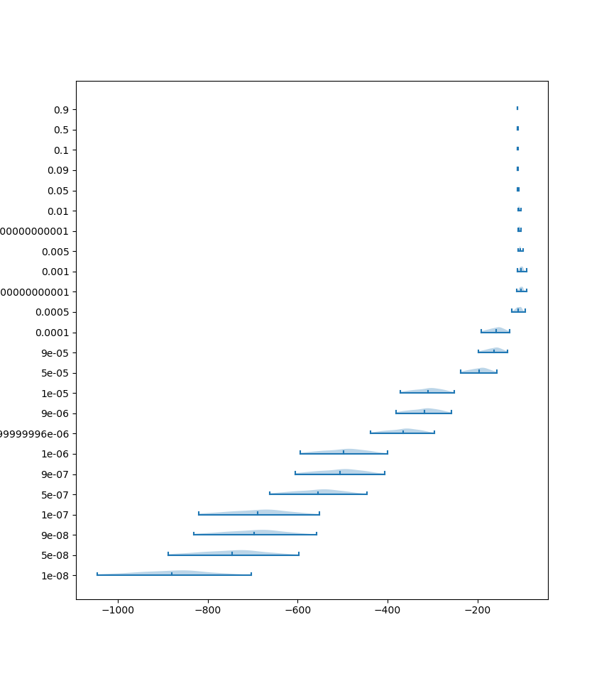
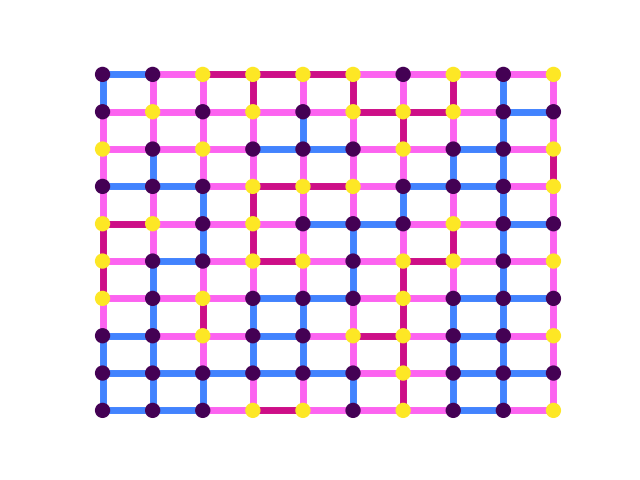

# Topics

- Multiple roots
- Deme types
- Multiple migration rates simulator

---

### From 2024-12-16 to 2024-12-29

Previously, `terracotta` would propagate the likelihoods from the tips to the root of the tree. As I showed in last weeks devlog, the more recent coalescent events are very impactful on the migration rate estimates.

Since this plot does not have axis labels, the x-axis is likelihood of the trees given a migration rate and the y-axis is the migration rate tested. I simulated 100 trees with a migration rate of 0.001. We see that for very low migration rates, there is a large spread in the likelihoods of the trees. This is because some of the trees have early coalescent events that are not supported when the migration rate is very low. The likelihoods peak around the true migration rate of 0.001, which is good to see.

We may be interested in chopping the trees at some point in the past. I did this same thing with the Brownian motion model. Chopping a tree below the root results in separate subtrees. For each of these subtrees, `terracotta` passes the likelihoods up to the root. Then it sums the likelihoods for that root. Finally, it multiplies the likelihood sums together to get the likelihood of the chopped tree. This equation below shows that if there is only one root in the tree, it collapses back to the original.

$$L_{\text{tree}} = \prod_{r \in \text{roots}}{\sum_{x \in \text{demes}}{L_{r}(x)}}$$

[CHECK THE EFFECT OF CHOPPING TREES ON LIKELIHOOD CURVES]

Right now the world map is looking pretty bland. In reality, migration rates are unlikely to be the same between every deme. Though `terracotta` has been pretty successful at estimating a single migration rate, I wanted to make sure that it could also handle more complex migration patterns. For now, I'm still going to assume symmetrical migration, though this could be a subsequent improvement if all goes well.

As we are adding more features to the world map, I thought it would be important to set up a good foundation to build on top of. Previously, the world map was stored as a `pandas.DataFrame`. I changed this to now be its own `WorldMap` class, with the attributes `demes` and `connections`. What's nice about this is I can apply different methods to the `WorldMap` that utilize both of these `pandas.DataFrame`s without having to pass them in individually. For instance, say I wanted to draw the world map... now it's as simple as `WorldMap.draw()`.

Demes now have a "type" which is used to determine the migration rates. I'm thinking that this type could be eventually assigned by some sort of GIS software. Say there are two types of demes on a given map. This means that there are three possible types of connections: type 0 to type 0, 0 to 1, and 1 to 1. Each of these connection could have a separate migration rate. In the above world map, I've colored the edges of the map by connection type.

It's important that `msprime` uses these new deme types (and all of the corresponding migration rates) when simulating the trees. In other words, the world map needs to be an input into the tree simulation rather than things being hardcoded. `_set_up_msprime_demography()` takes in the `terracotta.WorldMap` object as an input parameter alongside the specified migration rates. These rates are mapped to the associated deme connections, and the function returns the `msprime.Demography` object that is used in the `msprime` simulations.

I've changed the input files slightly! `world_map.tsv` is now `demes.tsv` - this is because the `terracotta.WorldMap` object may contain both the demes, connections, and samples, and I wanted to better differentiate that. The `sample` column in `samples.tsv` is now `id` to match the format of `demes.tsv`. These are quite minor changes so should hopefully not affect things significantly.