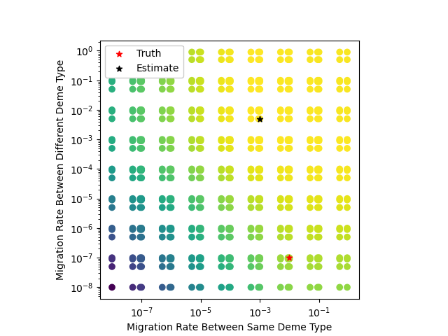
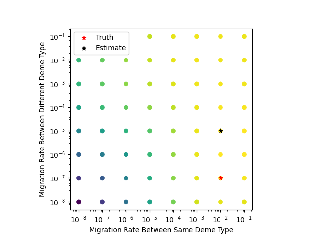
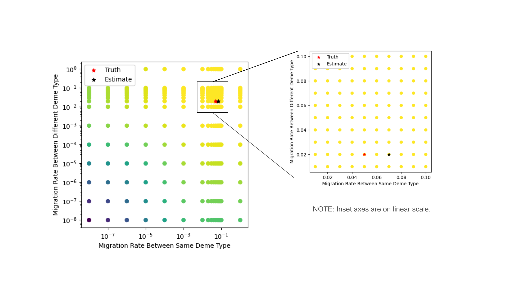

# Topics

- Estimating multiple migration rates

---

### From 2024-12-30 to 2025-01-12

I went back and forth on how to fit the dataset generator into `terracotta`. Most users will come to `terracotta` with their own datasets, so I didn't feel it needed to (or should) be integrated fully into the `WorldMap` class. Instead, I've decided that it should take a `WorldMap` in as a parameter. I may come back to this decision later. This leaves the methods internal to the `WorldMap` class specifically for running the belief propagation algorithm.

I wanted to generate some sort of README file or log alongside the other outputs that explains what input parameters were used to generate the dataset. Thinking about this more, I wonder if it would be better to not create a new directory to store the dataset but instead create the files in the same location as the script. I'll need to look into random seeds if I need to generate the exact same dataset (uncertain how `msprime` handles random seeds with multiple runs).

Setting the migration rates is not always intuitive as you don't necessarily know the connection type number especially as the number of deme types increases. There needs to be a more explicit way how handling this!

This doesn't look nearly as promising as I had hoped! This dataset included two rates (0.01 and 0.0000001 between the same deme type and different deme types, respectively). I need to make sure that the code is working as expected both for generating the dataset and estimating the rates, but this appears to not be terribly accurate at estimating the rates. My first thought is that the sensitivity to the initial coalescent events paired with the lack of consequences for having too high a migration rate leads to an overall overestimate of the lower of the rates.

I found a critical bug in `WorldMap.build_sample_location_vectors()` where I was setting the sample location incorrectly by using the sample's ID rather the sample's deme. This should not affect figures from previous devlogs, but the above figure needs to be rerun. I really need to look into how to build tests for my functions so that I can be confident they are functioning properly as I continue to develop `terracotta`.

Now after correcting the bug, the estimates are much better! `terracotta` still overestimates the between deme type migration rate by two orders of magnitude, but this isn't a complete surprise to me as it had a tendency to overestimate very low migration rates even in the single migration rate case. And it appears that all of the nearby migration rates seem to be at relatively the same level.

Even within a given magnitude, `terracotta` is able to get close to the true values using 100 independent trees with 25 tips each.

After talking with Graham, I think I need to take a step back and find a biological system or question that I want to investigate. Though working through the coding and math here has been fun, I think I'm starting to miss the point of why I'm doing it. This will also be important to making sure that the kinds of problems that I'm interested in have data that will work with the method I'm developing. This is really important with ARG-based methods because the cost of entry can be very high. I want this to be a usable method, especially since `sparg` had so many challenges.

Possible ideas:
- Comparing the migration maps of different systems that you'd expect to differ in interesting ways - I thought about this for a coevolving system as a way of supporting that they are linked, though this would not rule out that geography just plays a big role in both.
- Comparing the migration maps between neutral versus selected alleles - I think that this is the most approachable direction. I'd like to find a system that would be interesting to apply it to. First though was Arka Pal's snapdragons which would provide a pseudo one-dimensional setup where most traits could flow freely across the border but the coloration gets stuck to its respective side of the hybridization zone. A more geographically complex system may help to show that the method provides more information than just $F_{st}$.
- Epidemiological examples - I think that this would be really cool as the importance would be really graspable. But the world could be messy and though I'd love to learn more, I don't want to misstep into something controversial.