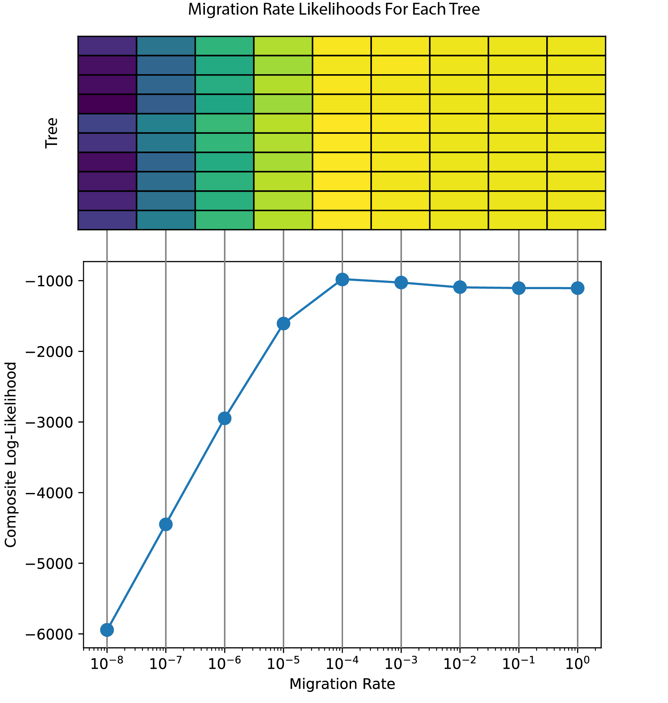
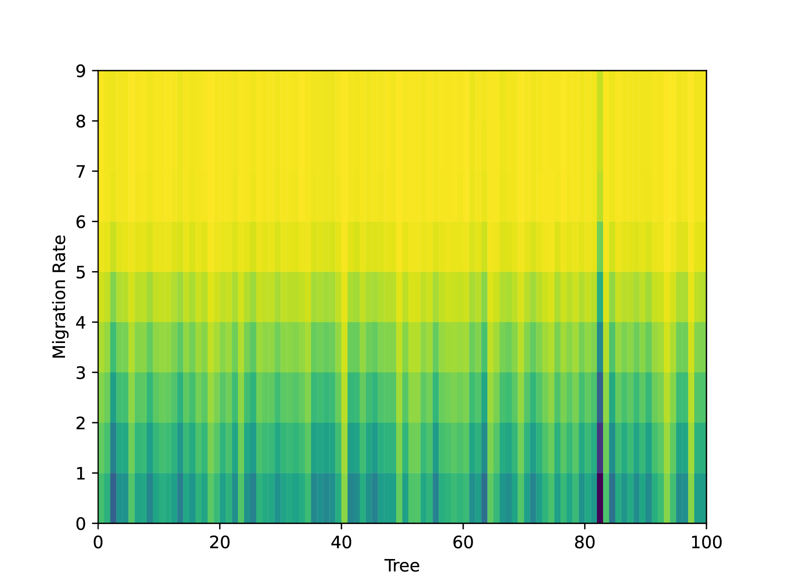

# Topics

- The WHY pitch
- Identifying important trees
- Discussion of selection's effect on results

---

### From 2025-01-13 to 2025-01-26

There are many similarities between `terracotta` and `EEMS` (Petkova et al. 2016) with both generating effective migration surfaces from genetic datasets. `EEMs` uses SNP and microsatellites to create a dissimilarity matrix between samples. Pairing this with the spatial coordinates of samples, the method can map out regions of the surface that require low or high migration to connect things together.

Other studies have shown that ARG/Tree methods can better highlight the underlying pattern by using the expected versus observed divergence (Speidel et al. 2025, Doc's preprint from 2024?). I believe that `terracotta` is kind of doing the same thing by using the trees rather than the mutations to look at dissimilarity between samples. Is this enough to differentiate  `terracotta` and make it worth working out this new method?

I think a potentially cool area to expand into that `EEMS` could not necessarily do is looking at loci (in this case trees) that fall outside of the standard migration patterns seen across the genome. I don't believe that `EEMS` would have had the power to do this as they would only have a single mutation here and there to look at, but the tree could give us more information. There are a few setups that I could see this being used:

- Hybrid zone where gene flow occurs across the genome except for standout loci. These loci would have high $F_{st}$ but should also estimate a different migration map if there is geographic correlation to population structure. One advantage compared to $F_{st}$ is you do not need to group samples prior to running the analysis as the migration map does not require labeling in inputs.
    - Silu Wang's Pacific Northwest warblers
    - Arka Pal's Spanish snapdragons

- Adaptation to local environments where selection prevents the gene flow of critical loci. Similar to the hybrid zone example, this would generate a differently shape migration map with regions of slow migration that did not exist in the "neutral" map.

- Selective sweeps which require higher effective migration to handle the more recent coalescent times.

One thing to consider is that we won't have nearly the same amount of power when comparing individual trees versus using them all together to build the map. As long as we are working more qualitatively in our comparison, I think that this is okay. We may be better at identifying scenarios like selective sweeps compared to reductions in gene flow due to the  nature of `terracotta` likelihood curves heavily penalizing migration rates that are too low.

The above shows some of the variability in likelihoods that we see between trees even when all of the trees are generated under the same parameters. Now, if one of the trees was for a locus under recent selection, I would expect it to have much lower likelihoods for low migration rates.

Simulations need to be done in `SLiM` rather than `msprime` so that the trees can take into account selection. For the following figure, I simulated 100 loci with free recombination between each; though the trees are "independent" (as far as I understand it), they will share the same underlying pedigree. I ran the simulation for 1500 generations and then mutated one individual to have a beneficial allele (s=0.5, h=0.5). I let it run for 100 more generations as the allele swept up in frequency. I had to run this simulation many times as the allele kept getting lost to drift before it got the chance to sweep. Finally, I had a successful run.

I'm curious how the tree corresponding with the sweep differs from the neutral trees when passed into `terracotta`. From this figure, we can see that while there is variation in the likelihood estimates, one tree stands out amongst the others as requiring a much higher effective migration. This is promising as it shows that `terracotta` has the potential to be sensitive to selection (that might actually be a bad thing if we are trying to avoid those effects, but at least right now it seems like a fun application). Even though the migration rate between demes was kept constant in the simulation, it's clear that selection can change the effective migration of loci.

One issue with this setup is that many of the trees are not very converged. Over half of the samples in each tree lack an edge above, which means that they are ultimately ignored from that tree's analysis. In some ways, the lack of coalescence is informative; the fact that it's missing means that migration rates are probably lower than if we completely remove them. At the moment, `terracotta` does not have a way of taking this into account, and I'm not sure how that would be done. To ensure that trees are fully coalesced, while also not having to wait an extremely long time in SLiM, I can do some sort of recapitation with `msprime`. I'll need to look into this.

What information does the migration map give that an allele presence/absence or frequency map does not? The biggest difference is the time component. The fact that you see an allele in one area but no where else could be that the allele is relatively new. If it has sweeped up to high frequency in that area and no where else, then you can start to question what's so special there, but the migration map more explicitly tells you that the dynamics of that allele are different than what is seen in the rest of the genome.