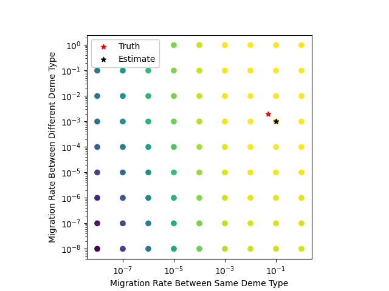
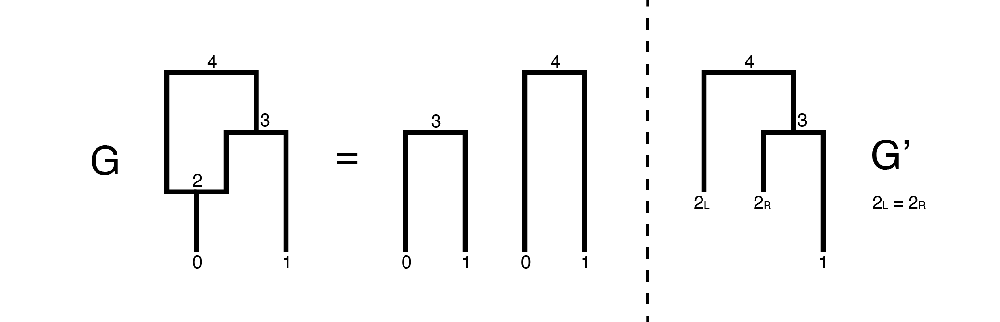
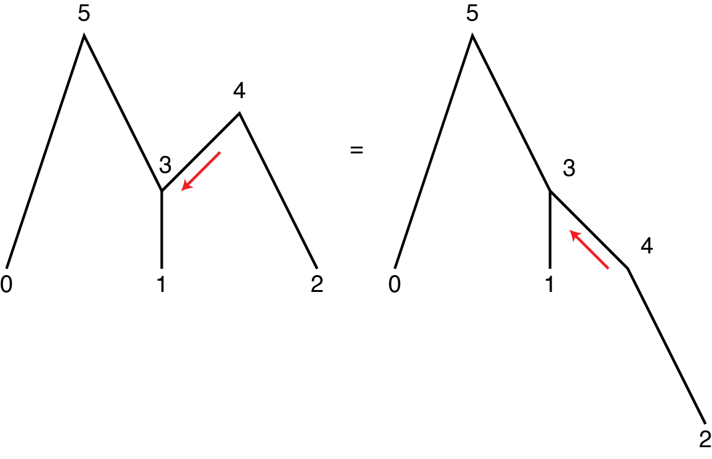
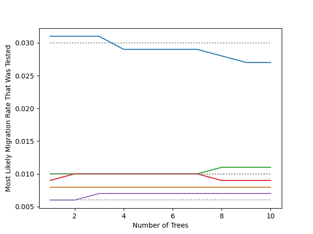

# Topics

- Branch length bug fix
- Junction tree algorithm

---

### From 2025-02-10 to 2025-02-23

Discovered a bug - When calculating the outgoing message from a node, I was incorrectly using the branch length to one of that node's children rather than to its parent. This has now been updated!

To find out the consequences of the previous bug, I reran the map builder dataset from the last devlog. There are some differences in the loglikelihoods calculated but overall it seems that the patterns are the same. That's not to say that this was not an issue and couldn't have led to incorrect results, but I think that our previous findings won't be altered too drastically.

When I first started this project, I had wanted to use the graphical structure of the ARG to estimate the migration surface and location of ancestors rather than individual trees. I've since decided to start with individual trees and make sure everything is working properly (a major task within itself) before trying to tackle the harder graphical structure that I predict will have some rabbit holes. Here's a recap of some of my previous findings as well as a short investigation into what I predict will be a problem with using the graphical structure of ARGs in `terracotta`.

There are two algorithms for Belief Propagation on graphs: junction tree and loopy belief propagation (LBP). LBP is an efficient approximate algorithm that may be helpful in the future but I'm not going to discuss right now. The junction tree algorithm is an exact algorithm but very inefficient so will likely not be useful beyond small tests. You can apply the junction tree algorithm to an ARG by "unfolding" the graph at recombination nodes. Below is an example for a two sample, two tree ARG:

$$L_{4}(i) = \sum_{x \in \text{demes}}{Pr(x|i,G')L_2(x)}$$

where

$$L_{2}(i) = \sum_{x \in \text{demes}}{Pr(x|i,t_{0,2})L_0(x)}$$.

The second equation calculates the likelihood of the location of Node 2 given the location of Node 0, which is its only child in the tree. Once we have the likelihood of the location of Node 2, we can unfold the tree, splitting Node 2 into two tips that have the same position. I define this tree as G'. We can then calculate the location of Node 4 (root) using the standard algorithm from `terracotta` but run multiple times for all of the possible positions of Node 2. Lastly, we scale the probability by the original likelihood of Node 2's position to get the final likelihood for the position of Node 4 (root).

Importantly, propagating messages from tip to root in this fashion only works when there is only one root to the graph. This is not an issue for trees because multiple roots means that there are separate subtrees and each subtree can be treated individually. With the graph, the roots are not independent, so messages need to be passed between the roots. This is not possible if we only propagate messages backwards in time. Here's an example of where this problem occurs.

Though Node 3 is a recombination node, the underlying structure of the graph is actually a tree (shown on the right by ignoring the time of nodes) as there aren't any loops even when edges are undirected. This means that we don't need the junction tree algorithm or anything fancy, we can just propagate the messages. But if we only propagate messages backwards in time as we normally do, then no messages are passed between Nodes 4 and 5 even though they aren't independent. You need to have at least one forward in time message (marked in red) to properly calculate the likelihoods at the root.

I'm going to focus only on ARGs with a single root since these should be enough for the following analysis, and this will allow me to avoid writing a new message scheduler. But this will be important to think about for ARGs in later processes, especially that I can't necessarily treat roots as independent for ARGs so will need to change how I calculate the tree likelihood based on the roots when things are more complex.

With Brownian motion on ARGs (`sparg`), we saw that as you weave more trees into the graph, the MLE of dispersal rate necessarily increases. This is poor behavior as looking at more data should not bias your estimates to always be higher. I am concerned that this may not just be an issue unique to Brownian motion but could also encompass other movement models, such as that used by `terracotta`. We've previously talked about using the trees to estimate the migration surface and then using the ARG to estimate the locations of ancestors given that migration surface, but if this bias between trees and ARGs exists for `terracotta`, we may be getting poor results combining them.

I want to measure the MLE of the migration rate using the individual trees versus the ARG for this simple scenario.

Five ARGs were simulated with `msprime` for a two deme demography with a migration rate of 0.01 between the demes. 100 chromosomes were simulated to build the ARG. ARGs were each filtered to a section of 10 trees. Dotted lines are the composite likelihood migration rate estimate across the 10 trees. Solid lines are the ARG estimates for a given number of trees. NOTE: `msprime` uses a two recombination node format whereas `terracotta` is assuming a single recombination node format. This means that ARG estimates are likely slightly off, but I don't think that this should affect the overall patterns for how the rate estimates change. Importantly, we see estimates increase, decrease, or stay the same as more trees are added to the ARG. This is really good news as this differs from the "always increase" pattern that we saw with Brownian motion! Because of the inefficiency of the junction tree algorithm, it is impossible to apply it to large ARGs. But the silver lining is that we may be able to calculate migration rates with trees and then apply them to an ARG when estimating the ancestral location as there seems to be better portability between trees and ARG estimates than we saw with Brownian motion.