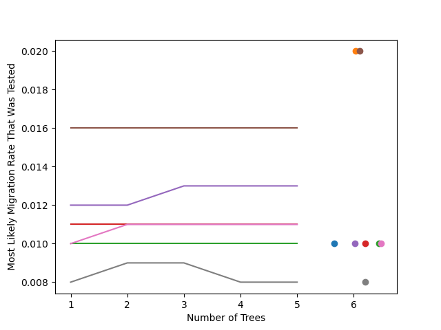

# Topics

- Junction tree algorithm

---

### From 2025-02-24 to 2025-03-09

As the end of the quarter geared up, progress has definitely slowed on research. Last devlog, I looked at whether the junction tree algorithm estimates faster migration rates as more trees are woven into the ARG, similar to the bias observed with `sparg`. I found for that for a case of two demes, migration rates can increase, decrease, or remain the same, which helped lessen my concerns that this will be an issue. But I wanted to test this one more time with more demes.

Here, I simulated five ARGs on a stepping-stone demography with a migration rate of 0.01 between neighboring demes. Each color in the plot corresponds with one of these ARGs. The line is the estimated migration rate for the ARG subset to a specified number of tree, and the dot is the composite likelihood estimate for the five-tree ARG. Once again, we see that estimates do not appear to have a clear bias as more trees are added to the ARG. Because of the inefficiency of the junction tree algorithm, I wasn't able to run for large ARGs, so I cannot we are completely out of the clear for larger scale biases, but it doesn't appear to be as much of an issue as we saw with `sparg`.

These findings have led to a rabbit hole in the `sparg` project. Why would it be a problem for `sparg` but not for `terracotta`? Puneeth has been really helpful in pulling this apart, and I believe that it's clarified my notation for `terracotta` back as early as the first devlog. In `sparg`, we condition on the paths through the ARGs meeting at the recombination nodes. This allows us to calculate $p(\vec{\ell} | n_{paths}, ARG, \sigma^2, \mu)$, is the probability distribution for the sample locations. But the junction tree algorithm, and Felsenstein's pruning algorithm as well (at least I think), does not condition on the recombination nodes and instead estimate the joint probability $p(\vec{\ell}, n_{paths} | ARG, \sigma^2, \mu)$. These two probabilities are related with the following

$$
p(\vec{\ell} | n_{paths}, ARG, \sigma^2, \mu) = \frac{p(\vec{\ell}, n_{paths} | ARG, \sigma^2, \mu)}{p(n_{paths} | ARG, \sigma^2, \mu)}
$$

Say you want to estimate the location of a node in the ARG, you would propagate messages up to the root (taking care for any recombination nodes). This gives you a vector values corresponding to the probability of being in that deme. But the values of this vector sum to $<1$; this is because you've actually calculated $p(\vec{\ell}, n_{paths} | ARG, \sigma^2, \mu)$ rather than $p(\vec{\ell} | n_{paths}, ARG, \sigma^2, \mu)$. You can convert this to $p(\vec{\ell} | n_{paths}, ARG, \sigma^2, \mu)$ by dividing every value by the sum of the vector which corresponds with $p(n_{paths} | ARG, \sigma^2, \mu)$. Working through this was really helpful to understand what is actually going on with `terracotta` and why it is different than `sparg`. There's definitely more to be investigated with this, but leaving it here for now.