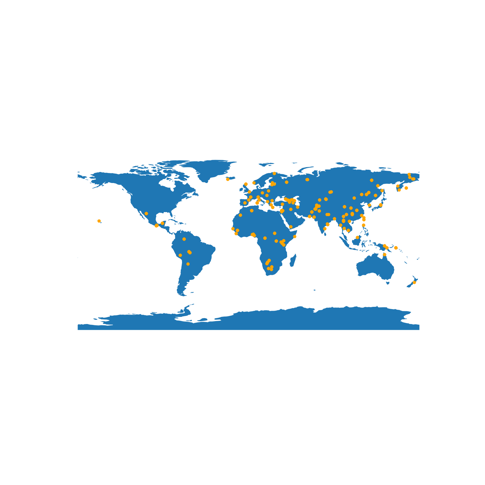
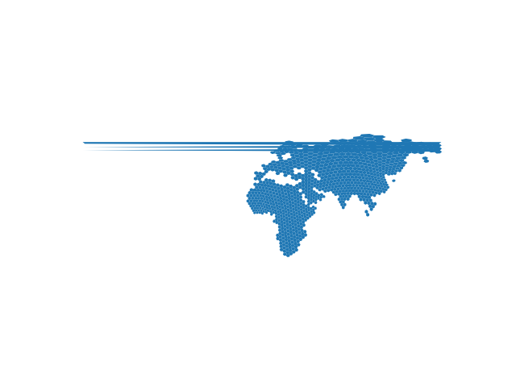
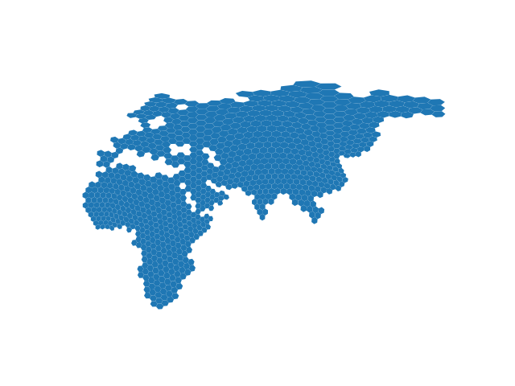
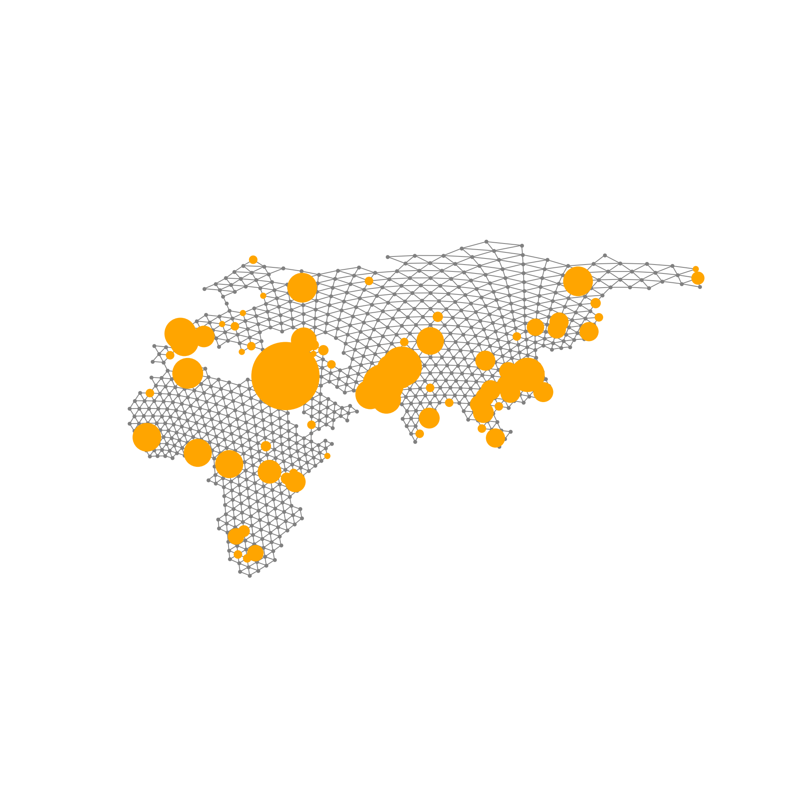
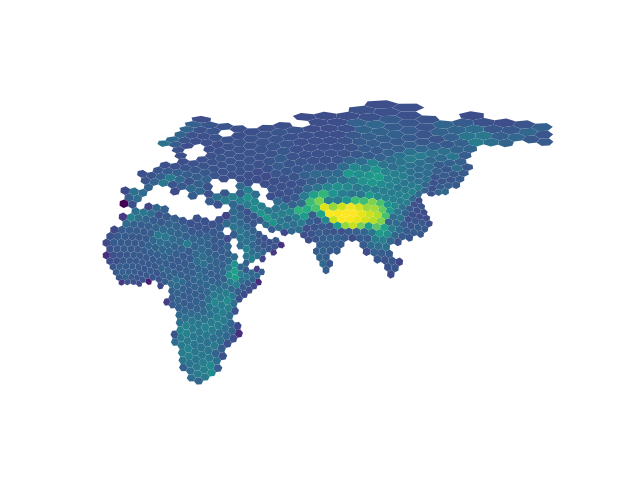
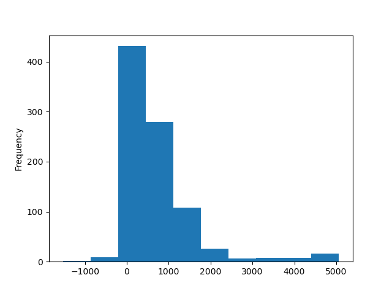
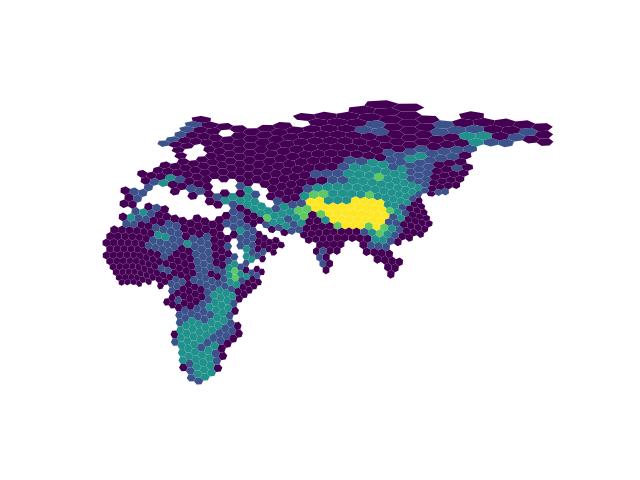

# Topics

- Empirical dataset
- Hexagonal world map
- Wohns tsdate ARG
- Working with raster files (elevation)
- Faster transition matrix calculation
- Locating ancestors

---

### From 2025-05-01 to 2025-05-12

Time to bring everything together to get my presentation ready for USC and eventually Evolution 2025. This will probably be a longer devlog as there's a lot of steps to wrangle the empirical datasets needed for the figures. By the end of this, I hope to have a pipeline for exploring the effects of different geographic factors on the migration rate estimates and locations of ancestors.

I'll be using the ARG for [chromosome 17p](https://doi.org/10.5281/zenodo.5512994) from *A unified genealogy of modern and ancient genomes* by Wohns et al. 2022. I chose this chromosome arm because it was small and had not been analyzed before (Grundler et al. 2024 looked at chromosome 18) and I don't know of significant problem regions on the chromosome to avoid. This ARG has geolocated samples across the world but mostly concentrated on Africa and Eurasia.



There are often many samples with the same geolocation, so the above plot has some overplotting issues that hide the true number of samples at each location. The basemap for this figure comes from the `geodatasets` Python package using the command `geodatasets.get_url("naturalearth land")`. I chose this dataset completely out of convenience (this also drove many of my other decisions in this exploration); it seems to have all that we need, though there could be better resources out there. I figured that because we were looking at rough features, we do not need to start with very high resolution datasets since the resolution was always going to be reduced.

`terracotta` requires that the world be chopped into many discrete demes. Africa and Eurasia was stored as a single geometry, so I pulled that out for focus and passed that into `h3pandas` for discretization into a hexagonal global grid with the following:

```
gdf = gpd.read_file(geodatasets.get_url("naturalearth land"))
gdf = gdf.loc[112:112]
resolution = 2
gdf_h3 = gdf.h3.polyfill_resample(resolution)
gdf_h3 = gdf_h3.reset_index()
gdf_h3["deme"] = gdf_h3.index
```

`h3` is hexagonal global grid system that offers multiple resolutions (https://h3geo.org). I'm using `h3pandas` to convert the polygons over into the separate hexagons. The resolution is arbitrary and I picked it just because wasn't too fine but still preserved the shape of the continents and seas.



There are errors in polygons that cross the antimeridian, seen at the top of the map. This is because `geopandas`/`matplotlib` are not aware of how coordinates wrap around the antimeridian, so are not plotted properly. Luckily, this only affects three of the hexagons in northeast Russia; none of these hexagons have samples in them (see later), so I chose to remove them.

We also see five hexagons that appear as islands, even though they are meant to be connected to the mainland. This includes the pennisulas of Thailand, Korea, and Kamchatka. This occurs because hexagons are only placed when the centriod of the hexagon is found on land. When the pennisula is so small, the centroid may end up in the ocean and therefore will not be included. I removed the five hexagons that were not attached to the main continent, but this could alternatively be handled by changing the inclusion rules to any hexagon that touches land or something similar rather than the centroid.



I used `geopandas.sjoin()` to place samples in their respective hexagon/deme. I filtered samples down to only allow one sample per deme; this step will hopefully not be necessary in the future but is due to performance efficiency concerns (see more details below). Lastly, I determined which hexagons were connected by first buffering the size of the hexagons slightly to ensure that neighbors overlapped then identifying all of the overlapping geometries. In a perfect world, buffering would not be necessary, but I saw that without it, some connections were not properly made. It is important to do this buffering after the `sjoin()` to ensure samples aren't attributed to multiple demes. I saved the `demes.tsv` and `samples.tsv` files, which can then be used as input into `terracotta`.



So far all of the demes have the same type, and therefore all of the transitions will be of the same type. We can and will run it with these conditions as the simplest scenario, but we can also incorporate more GIS layers to assign the deme types. I downloaded global elevation data from [NOAA](https://www.ngdc.noaa.gov/mgg/global/relief/ETOPO2/ETOPO2v2-2006/ETOPO2v2c/netCDF/) and opened with a combination of `xarray`, `rioxarray`, and `rasterio` (probably overcomplicating things in this process but I had a lot of trouble working this out). I calculated the average elevation in each hexagon using `rasterstats.zonal_stats()`, storing the output as an additional column in the `geopandas` dataframe containing the hexagons. One thing to note is that this includes the below sea level elevations in its calculations for hexagons along the coasts.





Looking at the distribution of elevations by deme, I binned them into five categories: less than 500m, 500m to 1000m, 1000m to 2000m, 2000m to 3000m, and greater than 3000m. This was again a relatively arbitrary choice, but I wanted some variation in the map and didn't want everything dominated by the Himalayas. 



Elevation bin can be used as the deme type, which means that there will be 14 possible transition types. This is much more complicated than any scenario that I've run previously but probably the lower edge of what would be considered by most subsequent `terracotta` users.

The current implementation of `terracotta` is too slow for MCMC (**The next paragraph describes a the solution to this problem.**). This is definitely a solved problem and there may be a very obvious fix, but I likely won't have time to deal with it this week. Right now it's taking approximately three minutes to calculate the likelihood of each migration matrix using 20 trees of 75 samples. The majority of the time is spent exponentiating the migration rate matrix to calculate the probability of location after a length of time. For the rest of this devlog, I'm going to be using hand-built migration matrices rather than ones estimated using MCMC for the sake of time, but figures should obviously be treated as a proof of concept rather than based in reality.

**Correction to the previous paragraph.** With a modified workflow, I believe that I have come worked out a fast enough solution to this problem. It still generally benefits from discretizing time in the ARG and involves precalculating the transitions matrices to avoid recalculating for branch lengths that appear multiple times. The first difference is that it now makes a numpy array of all of the unique branch lengths; though this is pretty fast, this array will only need to be calculated once as the trees aren't changing when trying different migration rates. Second, it exponentiates the matrix in the following:

$
M = (e^Q)^{t_1} = (e^Q)^{t_0}(e^Q)^{t_1-t_0}
$

$e^Q$ is obviously dependent on the migration rates but only needs to be calculated once, saving a decent amount of time as it otherwise would be recalculated for every edge in every tree. By splitting $(e^Q)^{t_1}$ into two parts, it can take advantage of having already calculated $(e^Q)^{t_0}$, which saves a surprising amount of time. For instance set of 39 non-discretized trees took 6min59s (wall time) to calculate all of the transition matrices, whereas with this new method it only 1min37s. Comparing the output matrices from the two methods, there are small differences which I associate with floating point imprecision due to separation of the calculation. These generally get worse for longer branch lengths, the largest summed elementwise difference between the corresponding matrices being 3.4366e-11. For the efficiency improvements, I would say that this is well worth it, and the tree likelihoods appear to match as expected.

Locating ancestral nodes is the final step and luckily will use many of the same ideas already discussed. To do this, you just need to propagate the message up to the root and then back down. I decided I would not do this in log-space and instead rescale between 0 and 1 every step of the way. You can't do that when you are calculating the likelihood of the migration rates, but it works in this scenario and is easier for me to wrap my head around. I will likely come back to this and make it more efficient, but because I am only looking at one tree at a time, it is generally pretty fast. I've made a GIF for the locations of different nodes over time. My goal for Evolution will be to apply update these GIFs so that they are smoother (with locations of lineages along branches rather than just at nodes as currently there's large gaps in time between frames).